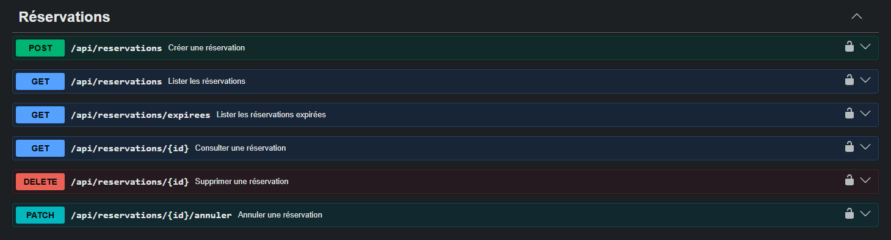

# Séance 2 — Module Réservation

> Contenu prêt à coller dans la description de la Pull Request
> `feature/reservation-kepseu-franck` → `main`.

Un livre déjà emprunté ne peut plus être emprunté. Ce module permet à un adhérent
de se mettre en file d'attente dessus : il réserve, et la réservation vaut sept
jours.

Le module est **entièrement côté backend**. Aucune ligne du front Angular n'est
touchée, et `pom.xml` reste intact — la contrainte de la séance 1 tient toujours.

---

## Capture Swagger



La documentation est servie par le conteneur `bibliotheque-swagger` mis en place
en séance 1 : `docker compose up -d`, puis <http://localhost:8081>. Les six
opérations sont regroupées sous le tag **Réservations**.

---

## Les endpoints

| Verbe | Chemin | Rôle | Succès | Erreurs |
|---|---|---|---|---|
| POST | `/api/reservations` | Créer une réservation | 201 | 400, 404, 409 |
| GET | `/api/reservations` | Lister, filtrable par `statut` et `adherentId` | 200 | 400 |
| GET | `/api/reservations/{id}` | Consulter | 200 | 404 |
| PATCH | `/api/reservations/{id}/annuler` | Annuler | 200 | 404, 409 |
| DELETE | `/api/reservations/{id}` | Supprimer | 204 | 404 |
| GET | `/api/reservations/expirees` | **Bonus** — lister les réservations expirées | 200 | — |

Le client n'envoie que `livreId` et `adherentId`. `dateReservation`,
`dateExpiration` et `statut` sont déterminés par le serveur.

Ces routes ne sont **pas publiques**, contrairement à `/borrow/**` :
`WebSecurityConfiguration` les laisse sous `anyRequest().authenticated()`. Il
faut donc un jeton — `POST /authenticate` avec `admin` / `admin123`, puis le
bouton **Authorize** de Swagger.

---

## Où chaque règle de gestion est implémentée

| Règle | Implémentation |
|---|---|
| **RG-01** — on ne réserve qu'un livre indisponible | `ReservationService.verifierLivreIndisponible` (ligne 217) refuse en 409 dès que `noOfCopies > 0`, sur le compteur que `BorrowController` décrémente à l'emprunt. |
| **RG-02** — une seule réservation active par livre | `ReservationService.verifierAbsenceDeDoublon` (ligne 228) interroge `existsByLivre_BookIdAndAdherent_UserIdAndStatutIn` avec les seuls statuts actifs, et lève un 409 en cas de doublon. |
| **RG-03** — trois réservations actives au maximum | `ReservationService.verifierPlafondDeReservations` (ligne 241) compte les réservations actives de l'adhérent via `countByAdherent_UserIdAndStatutIn` et refuse à partir de la quatrième. |
| **RG-04** — expiration = réservation + 7 jours | `ReservationService.creer` (ligne 68) pose `dateReservation = LocalDateTime.now()` puis `dateExpiration = dateReservation.plusDays(7)` ; le DTO d'entrée n'expose aucun de ces deux champs, le client ne peut donc pas les fournir. |
| **RG-05** — on n'annule que depuis EN_ATTENTE ou DISPONIBLE | `ReservationService.annuler` (ligne 147) refuse en 409 si le statut courant est définitif. |
| **RG-06** — un statut définitif ne change plus | Porté par le type lui-même : `StatutReservation.estDefinitif()` marque ANNULEE, EXPIREE et HONOREE, et c'est ce prédicat que `annuler` et `expirerLesReservationsEchues` consultent avant toute transition. |

La notion de réservation *active* n'est écrite qu'une fois, dans
`StatutReservation.statutsActifs()` : RG-02, RG-03, RG-05 et l'expiration
automatique s'appuient tous dessus, elle ne peut pas diverger d'une règle à
l'autre.

Chaque message d'erreur 409 commence par la référence de la règle enfreinte :

```json
{
  "horodatage": "2026-08-21T09:48:13.695",
  "statut": 409,
  "erreur": "Conflict",
  "message": "RG-03 : Marie Dupont a déjà 3 réservations actives ; le maximum est de 3."
}
```

---

## Architecture

Le découpage du projet existant est repris tel quel : `entity`, `dao`,
`service`, `controller`, plus un paquet `dto` créé pour l'occasion.

| Fichier | Rôle |
|---|---|
| `entity/Reservation.java` | L'entité. Deux `@ManyToOne` vers `Books` et `Users`, deux `LocalDateTime`, un statut en `EnumType.STRING`. |
| `entity/StatutReservation.java` | L'énumération, et la définition d'un statut « actif » / « définitif ». |
| `dao/ReservationRepository.java` | `JpaRepository`, plus les requêtes dérivées de RG-02, RG-03 et du balayage des échéances. |
| `dto/ReservationRequestDTO.java` | Deux champs : `livreId`, `adherentId`. |
| `dto/ReservationResponseDTO.java` | La vue de sortie, relations aplaties en identifiant + libellé. |
| `service/ReservationService.java` | Validation, chargement, les six règles, conversion en DTO. |
| `controller/ReservationController.java` | Les six routes. Aucune décision métier. |
| `exceptions/BadRequestException.java` | 400. |
| `exceptions/ConflictException.java` | 409, règle de gestion enfreinte. |
| `exceptions/ApiError.java` | Le corps JSON des erreurs. |
| `exceptions/ReservationExceptionHandler.java` | La traduction exception → réponse HTTP. |
| `configuration/ReservationExpirationScheduler.java` | **Bonus** — bascule horaire des réservations échues en EXPIREE. |
| `configuration/CorsConfiguration.java` | *(modifié)* ajout de PATCH. |
| `docker/openapi.yaml` | *(modifié)* les six opérations, leurs codes de retour et leurs exemples d'erreur. |
| `src/test/.../ReservationServiceTest.java` | **Bonus** — 10 tests unitaires sur les six règles. |

**L'entité ne sort jamais du service.** Le contrôleur ne connaît que les deux
DTO. C'est aussi ce qui évite de rejouer le défaut relevé en séance 1 sur
`/admin/users`, où l'entité `Users` renvoyait le haché du mot de passe : ici, la
réponse ne contient que l'identifiant et le nom de l'adhérent.

---

## Trois décisions à signaler

**La validation est écrite à la main, pas annotée.** Le projet n'embarque pas
`hibernate-validator` et `pom.xml` reste intouchable : `@NotNull` et `@Valid`
seraient chargés sans effet, et une requête sans `livreId` passerait en silence.
`ReservationService.valider` (ligne 198) fait donc le contrôle explicitement, et
le message nomme le champ manquant — `Le champ « livreId » est obligatoire.`

**Le gestionnaire d'erreurs est volontairement restreint au module.**
`@RestControllerAdvice(assignableTypes = ReservationController.class)` : un
conseil global aurait changé au passage le corps des réponses d'erreur des
contrôleurs existants, donc le contrat que consomme déjà le front. Il fallait
bien un corps de réponse quelque part — depuis Spring Boot 2.3,
`server.error.include-message` vaut `never` et un `@ResponseStatus` seul renvoie
le bon code avec un message vide.

**CORS : PATCH manquait.** `CorsConfiguration` n'autorisait que GET, POST, PUT et
DELETE. Le prévol `OPTIONS` refusait donc `PATCH /api/reservations/{id}/annuler`,
et l'annulation restait injoignable depuis un navigateur — Angular sur `:4200`
comme Swagger UI sur `:8081` — alors qu'elle répondait parfaitement en `curl`.
Une ligne ajoutée, et le prévol renvoie bien `Access-Control-Allow-Methods: ...
PATCH`.

---

## Bonus

Les trois pistes de l'énoncé sont traitées.

- **Tests unitaires.** `ReservationServiceTest` couvre les six règles, dont deux
  cas pour RG-03 : la quatrième réservation refusée, et la troisième encore
  acceptée. Dépôts simulés avec Mockito, aucun contexte Spring, aucune base.
  `mvn test -Dtest=ReservationServiceTest` → **10 tests, 0 échec**.
- **Endpoint des réservations expirées.** `GET /api/reservations/expirees`.
- **Expiration automatique.** `ReservationExpirationScheduler` balaie chaque
  heure les réservations actives dont la date est dépassée et les bascule en
  EXPIREE. Le statut est écrit en base, et non déduit à l'affichage : une
  réservation périmée qui resterait EN_ATTENTE continuerait de peser dans RG-02
  et RG-03, et bloquerait l'adhérent pour rien.

---

## Vérifications

Compilation et tests unitaires, dans l'image de build du projet :

```
[INFO] Tests run: 10, Failures: 0, Errors: 0, Skipped: 0
[INFO] BUILD SUCCESS
```

Puis 31 assertions passées de bout en bout sur la pile `docker compose`, contre
le backend réel et sa base MySQL :

- 400 sur `livreId` manquant, sur `adherentId` manquant, sur corps absent
- 404 sur livre inconnu, adhérent inconnu, réservation inconnue (GET, PATCH, DELETE)
- 409 RG-01 sur un livre disponible
- 201, avec `dateExpiration - dateReservation = 7 jours` exactement
- 409 RG-02 sur le même couple (livre, adhérent)
- 201, 201, puis 409 RG-03 à la quatrième réservation active
- filtres `statut` et `adherentId`, casse libre, 400 sur un statut inconnu
- 200 puis 409 RG-05/RG-06 sur une double annulation
- une nouvelle réservation acceptée après annulation, ce qui prouve que le
  plafond compte les réservations **actives** et non l'historique
- 204 puis 404 sur une double suppression
- 401 sans jeton
- prévol `OPTIONS` autorisant `PATCH`

La table créée par Hibernate au démarrage :

```
reservation_id    int         NO   PRI   auto_increment
date_expiration   datetime    NO
date_reservation  datetime    NO
statut            varchar(20) NO
user_id           int         NO   MUL
book_id           int         NO   MUL
```
